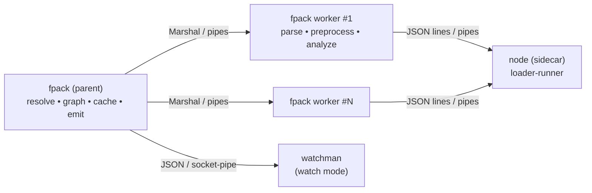
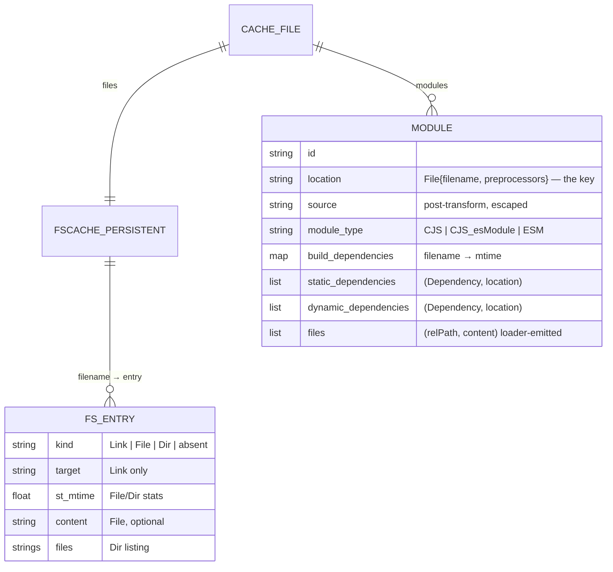

# Fastpack — Codebase Knowledge Document

> A complete "brain dump" of the fastpack repository, intended to let another engineer or LLM
> implement features, fix bugs, and refactor safely without re-deriving the architecture.
>
> Analyzed at commit `173e0a4` ("bump version", v0.9.2); pass 3 verified against repo head
> `23b29a3` (docs-only merge — source unchanged). All paths are relative to the repo root.
> Supplemental files: [`assets/architecture.mmd`](assets/architecture.mmd),
> [`assets/build-sequence.mmd`](assets/build-sequence.mmd),
> [`assets/FILE_INDEX.md`](assets/FILE_INDEX.md),
> [`assets/TEST_FIXTURES.md`](assets/TEST_FIXTURES.md).

---

## Table of Contents

1. [High-Level Overview (Phase 1)](#1-high-level-overview)
2. [System Architecture (Phase 2)](#2-system-architecture)
3. [Feature-by-Feature Analysis (Phase 3)](#3-feature-by-feature-analysis)
4. [Nuances, Subtleties & Gotchas (Phase 4)](#4-nuances-subtleties--gotchas)
5. [Technical Reference & Glossary (Phase 5)](#5-technical-reference--glossary)
6. [State Block, Assumptions, Open Questions](#6-state-block)

---

## 1. High-Level Overview

### 1.1 What the application is

**Fastpack** is a JavaScript **bundler** — a command-line tool (`fpack`) that takes an
application entry point (e.g. `src/index.js`), walks its `import`/`require` dependency graph,
transpiles/preprocesses each module, and packs everything into a single browser-loadable
JavaScript bundle (plus lazily-loaded chunks for dynamic `import()`s). It competes with
Webpack and Parcel; its selling point is **speed** (README benchmark: ~0.73s initial build of
~1600 modules vs 3.6s Webpack / 9.7s Parcel; ~0.08s watch-mode rebuilds).

Target users are frontend JavaScript developers (typical fixture: a Create-React-App-style
React app — see `test/pack-cra/`).

### 1.2 How it achieves speed (the three core bets)

1. **Native code**: written in **Reason (OCaml syntax)**, compiled to a native binary with
   `dune`, using the OCaml port of Facebook's **Flow parser** (`@fastpack/flow_parser`) for JS
   parsing. No JS VM startup or JIT warmup.
2. **Parallelism**: parsing/transpilation/analysis runs in a pool of **worker subprocesses**
   (one per CPU, `Fastpack/Worker.re`), while the single parent process does resolution,
   graph-building, caching, and emission using **Lwt** cooperative async IO.
3. **Aggressive caching**: an in-memory + persisted **filesystem cache** (`Fastpack/FSCache.re`)
   and a **module cache** (`Fastpack/Cache.re`) that survives across runs
   (`node_modules/.cache/fpack/...`), letting warm builds skip parsing entirely.

A fourth design shortcut matters for understanding the code: fastpack does **not** print a
transformed AST for module rewriting. Instead it applies **string patches** at parser-reported
offsets over the original source (`Fastpack/Workspace.re`), which is far cheaper than
pretty-printing. The AST printer (`FastpackUtil/Printer.re`) is only used when the *builtin
transpilers* actually change the AST.

### 1.3 Tech stack

| Layer | Technology |
|---|---|
| Language | Reason (`.re`) — OCaml 4.6.x; a few `.ml` test files; one C stub (`FastpackUtil/sysutil.c`) |
| Build | `dune` (see `dune-project`, per-directory `dune` files) driven by **esy** (`package.json` + `esy.lock/`) |
| Async | `lwt` + `lwt_ppx` (`let%lwt`, `switch%lwt`) |
| CLI | `cmdliner` |
| Parsing JS | `@fastpack/flow_parser` 0.81.0 (vendored fork of Flow's parser) |
| JSON | `yojson` |
| Regex | `re` (POSIX syntax) |
| Terminal colors | `pastel` (JSX-like syntax in `.re` files — this is why you see `<Pastel …>` markup in error/CLI code) |
| Webpack-loader interop | Node.js sidecar `node-service/index.js` using `loader-runner` |
| Tests | `ppx_expect`/`ppx_inline_test` unit tests (`FastpackTest/`), snapshot integration tests (`test/` + `scripts/test.js`) |
| CI/Release | Azure Pipelines (`azure-pipelines.yml`); npm package `fastpack` shipping prebuilt binaries (`dist/`) |

### 1.4 Main features and their business purpose

| Feature | Business purpose | Backbone code |
|---|---|---|
| `fpack build` (default command) | Produce a deployable/dev bundle in one shot | `Fastpack/Commands.re` (`Build`), `Fastpack/Builder.re` |
| `fpack watch` | Sub-100ms incremental rebuilds during development | `Commands.re` (`Watch` + `Watchman`), `Builder.rebuild` |
| Persistent cache | Near-instant warm restarts (`0.171s` benchmark) | `Fastpack/Cache.re`, `Fastpack/FSCache.re` |
| Node-style resolution + `browser` field + mocks | Bundle real-world npm packages without config | `Fastpack/Resolver.re`, `Fastpack/Package.re` |
| Builtin transpilers (JSX, Flow strip, class props/decorators, object spread) | Zero-config support for the common React stack, without Babel's cost | `FastpackTranspiler/*` |
| Webpack loader support (`--preprocess`) | Escape hatch to the whole Webpack-loader ecosystem (babel-loader, css-loader, url-loader…) | `Fastpack/Preprocessor.re`, `node-service/index.js` |
| Code splitting via dynamic `import()` | Smaller initial payloads; chunks loaded on demand | `Fastpack/Bundle.re` |
| `NODE_ENV` folding + `--env-var` inlining | Dead-code elimination of dev-only branches; env config in bundles | `Fastpack/Mode.re`, `Config.EnvVar`, `Bundle.runtimeMain` |
| Import/export validation | Fail fast with a clear "Cannot import name X" error instead of a runtime `undefined` | `Fastpack/ExportFinder.re` |
| `fpack explain-config` | Debuggability: show effective config and where each value came from | `Config.prettyPrint` |
| Friendly diagnostics | Codeframes, resolver traces, node-lib polyfill hints | `Fastpack/Error.re`, `RunAsync.withContext` |

How they interact at a high level: **Config** feeds **Builder**, which drives the
**DependencyGraph** builder; the graph consults the **Resolver** (which consults the
**Cache**) and reads/transforms modules through the **Worker pool** (which runs the
**Preprocessor** chain — builtin transpilers in-process, Webpack loaders via the Node
sidecar). The completed graph is validated by **ExportFinder**, partitioned and serialized by
**Bundle**, and the **Cache** is persisted. **Watch** re-enters the same pipeline
incrementally.

---

## 2. System Architecture

### 2.1 Process model

Fastpack at runtime is **up to three kinds of OS processes**:

1. **Parent** `fpack` process — CLI, config, resolver, graph, cache, bundling, watchman client.
2. **N worker processes** (`fpack worker`, N = CPU count via `Environment.getCPUCount()`) —
   each is *the same binary* re-invoked with the hidden `worker` subcommand
   (`Commands.re` → `module Worker`). Communication is **OCaml `Marshal` values over
   stdin/stdout pipes** (`Lwt_io.read_value`/`write_value`; pool managed by `Lwt_pool` in
   `Worker.Reader`, process plumbing in `FastpackUtil/Process.re`).
3. **One Node.js sidecar** (`node-service/index.js`, pool size 1 —
   `Preprocessor.NodeService.make`) — runs Webpack loaders via `loader-runner`.
   Communication is **newline-delimited JSON over stdin/stdout**. It watches
   `FASTPACK_PARENT_PID` (injected by `Process.addPid`, using the C stub `pid_of_handle`)
   and kills itself if the parent dies. In watch mode, a **watchman** process is also spawned.



> Note: each **worker** owns its own `Preprocessor` instance and therefore the node-service is
> spawned lazily *per worker* (pool of 1 within each worker process).

### 2.2 The build data flow

See [`assets/build-sequence.mmd`](assets/build-sequence.mmd) for the full sequence diagram.
Condensed flow for `fpack build --development ./src/index.js`:

```
Config.term (Config.re)            CLI args ⊕ fastpack.json ⊕ defaults → Config.t
  └─ Builder.make (Builder.re)     entry points normalized; tmp dir ".fpack-<rand>" created;
                                   Worker.Reader pool created; Cache loaded; project package.json read
      └─ Builder.build             Resolver.make; Context assembled; mode==Production ⇒ PackError(NotImplemented)
          └─ DependencyGraph.build async BFS from Module.Main([entries])
              ├─ Cache.getModule?  cached module fresh (build-dep mtimes match) ⇒ skip worker
              ├─ Worker.Reader.read → worker: Preprocessor.run → analyze() → patched source + deps
              ├─ DependencyGraph.resolve → Resolver.resolve per request
              └─ recurse into unseen locations (deduped by Lazy promise per location)
          └─ ExportFinder.ensure_exports  (import-name validation; PackError on missing)
          └─ Bundle.make            chunk assignment from dynamic imports
          └─ Bundle.emit            runtime + eval-wrapped modules → tmp dir → atomic rename to outputDir
  └─ Cache.save                    Marshal {FSCache, modules} → node_modules/.cache/fpack/cache-<md5>-<commit>
```

### 2.3 The emitted bundle format (contract with the browser)

`Bundle.runtimeMain` (`Fastpack/Bundle.re:28-168`) emits a Webpack-inspired IIFE:

- Modules are an object literal: `{"<module_id>": {m: function(module, exports, __fastpack_require__) {eval("…src…")}, d: {"<request>": "<dep_module_id>"}, c: {"<request>": ["1.js"]}}`.
  - `m` — the module factory; **the source is a JSON-escaped string executed via `eval`** with
    a trailing `//# sourceURL=fpack:///<path>` for devtools (`Worker.re:730-736`, escaping via
    `Worker.to_eval`).
  - `d` — maps the *encoded* dependency request string to the resolved module id.
  - `c` — for dynamic imports, maps request → list of chunk files to load first.
- `__fastpack_require__(fromModule, request)` resolves `request` through `modules[fromModule].d`,
  caches instances in `installedModules`, and exposes helpers:
  - `.default(exports)` — interop: returns `exports.default` if `__esModule` else `exports`.
  - `.omitDefault(module)` — for `export * from`, copies all keys except `default`.
  - `.imp(fromModule, request)` — dynamic import: injects `<script>` tags for the chunk files
    (`state.publicPath + chunk`), memoized in `loadedChunks`, then requires the module. Returns a Promise.
  - `.state.publicPath` — from `--public-path`.
- Entry: `__fastpack_require__(null, "$fp$main")` — the synthetic main module.
- Environment shims are prepended: `global.process.env.<K> = <v>` for every `--env-var` and
  `NODE_ENV` (from mode), `process.browser = true`, throwing `Buffer` stub, `setImmediate` shim.
- Non-main chunks are wrapped as `global.__fastpack_update_modules__({ ...modules })`
  (`Bundle.runtimeChunk`), which merges chunk modules into the registry and **throws if a module
  id already exists**.

### 2.4 Cross-cutting concerns

- **Error handling**: two channels.
  - *User errors* → `Error.PackError(reason)` (`Fastpack/Error.re`, `reason` variants like
    `CannotResolveModule`, `CannotParseFile`, `CannotFindExportedName`,
    `CannotLeavePackageDir`, `ScopeError`, `PreprocessorError`) rendered by `Error.toString`
    with codeframes (`get_codeframe`) and, for unresolvable node builtins (`fs`, `crypto`…),
    an actionable hint from the `nodelibs` table suggesting `npm install <browserify-shim>` +
    `--mock` (`Error.re:8-42,191-229`).
  - *CLI exit* → `Error.ExitError(message)` / `ExitOK` caught in `Commands.run` (`Commands.re:12-39`).
  - Resolver failures accumulate a human-readable **context trace** ("Resolving 'react'." /
    "File exists? '…/react.js' …no.") via the `Run`/`RunAsync` result monads
    (`Fastpack/Run.re`, `Fastpack/RunAsync.re` — `withContext` prepends lines).
- **Logging**: `logs` library; `--debug/-d` enables `Logs.Debug` with timing probes scattered
  through `Builder.buildAll`, `Worker.process`, `Bundle.make`.
- **Security/limits**: modules **must live under `projectRootDir`** or the build fails with
  `CannotLeavePackageDir` (`DependencyGraph.read_module`, `DependencyGraph.re:313-320`);
  the node-service refuses to write emitted files outside the output dir (`node-service/index.js:202-211`).
- **Windows support**: pervasive `Sys.win32` branches (path separators in `Resolver`,
  `Module.location_to_string`, binary-file reads in `FSCache.read`, `pid_of_handle`).
- **No authentication/database/network** — fastpack is a local build tool; there are no
  services or third-party APIs beyond the subprocesses above.

### 2.5 Architectural patterns and conventions

- **Modules-as-components**: each `Fastpack/*.re` file is one component; `.rei` files exist for
  the modules with stable public surfaces (`DependencyGraph.rei`, `Worker.rei`, `Config.rei`,
  `Cache.rei`, `FSCache.rei`, `Bundle.rei`, `Preprocessor.rei`, `Resolver.rei`, `Package.rei`).
- **Two AST traversal frameworks** in `FastpackUtil/` (full contracts incl. blind spots: §5.7):
  - `Visit.re` — read-only visitor with `Continue/Break` actions and a parent stack
    (`AstParentStack.re`). Used by `Scope.re` and `Worker.analyze` (analysis + side-effect patches).
  - `AstMapper.re` — rewriting mapper (statement → list of statements, etc.) that tracks scope
    and signals modification via `Loc.none` on returned nodes. Used by the four builtin transpilers.
- **Patch-don't-print**: source rewriting is expressed as `Workspace` patches keyed by parser
  offsets; the original text is preserved wherever unchanged.
- **Result monads with context** (`Run`, `RunAsync`) + `ppx_let` `let%bind` for the resolver.
- **Hashtbl multi-binding idiom**: `DependencyGraph` uses `Hashtbl.add` (not `replace`) +
  `find_all` so one key (module location) maps to *many* dependency edges.

---

## 3. Feature-by-Feature Analysis

### 3.1 CLI & configuration

**Purpose**: single ergonomic entry point; config from flags or `fastpack.json` with clear precedence.

**Mechanics** (`bin/fpack.re`, `Fastpack/Commands.re`, `Fastpack/Config.re`):

- `bin/fpack.re` sets an 8MB default `Lwt_io` buffer, then `Term.eval_choice(default, all())`.
  Commands self-register via the `register` ref-list (`Commands.re:41-46`). Registered:
  `explain-config`, `build`, `transpile`, `watch`, `worker`, `help`; **default = `build`**
  (`Commands.Default`, whose man page warns that production mode is disabled).
- `Config.term` composes ~15 Cmdliner args → `Config.create`, which:
  - Loads `./fastpack.json` if present (or `-c FILE`); unknown keys are rejected with the full
    allowed list (`Config.File.checkKeys`; keys starting with `_` are ignored on purpose).
  - Resolves precedence per value: **CLI arg > config file > default** (`pickValue`); list
    options *concatenate* arg-list then file-list (`mergeLists` — so CLI mocks/preprocessors
    prepend to file ones).
  - Defaults: entryPoints `["."]`, outputDir `./bundle`, outputFilename `index.js`, mode
    **Production**, cache Use, nodeModulesPaths `["node_modules"]`, resolveExtensions
    `[".js", ".json"]`, packageMainFields `["browser","module","main"]`.
  - Validates: output filename must live under output dir (`Config.re:598-623`); preprocessor
    list may contain the catch-all pattern (`.+`) only in last position
    (`Config.Preprocessor.checkList`).
  - envVars: for each declared `NAME=DEFAULT`, the *actual* environment is consulted at config
    time (`Unix.getenv`), falling back to the default; `NODE_ENV` is always injected from the
    mode (`Config.re:628-651`).
- Every value remembers its `source` (`File | Arg | Default`) purely so `explain-config` can
  annotate output (`Config.prettyPrint`, rendered with Pastel JSX).

**Interactions**: `Config.t` is read via getter functions only (e.g. `Config.entryPoints`);
`Cache` derives its **cache identity** from config values (see 3.7) — changing resolution- or
preprocessing-affecting options automatically switches to a different cache file.

**Edge cases**: `--dev`/`--development` is a flag (vflag), not `--mode`; `--no-cache` disables
cache; `fpack.json` booleans: `"development": true`, `"cache": false`.

### 3.2 Build orchestration (`fpack build`)

**Purpose**: turn config + entry points into an emitted bundle, once.

**Mechanics** (`Commands.Build`, `Fastpack/Builder.re`):

- `Builder.make(config)`:
  - Entry points that name existing **files** are normalized to `./relative/path` form
    (`Builder.re:24-38`); the synthetic entry becomes `Module.Main(entry_points)`.
  - `tmpOutputDir` = `FS.makeTempDir(dirname(outputDir))` → a sibling `.fpack-<random-int64>`
    directory. All emission happens there; the final step atomically renames it over `outputDir`.
  - Creates the `Worker.Reader` pool and loads the `Cache` (or `Cache.Empty` if `--no-cache`).
  - Finds the **project package.json** by walking up from cwd (`find_package_for_filename`).
- `Builder.build(~one, ~dryRun, builder)`:
  - Creates a *fresh* `Resolver` per build (its memo tables must not leak across rebuilds).
  - **Raises `PackError(NotImplemented)` when mode == Production** (`Builder.re:286-295`) —
    only `--development` works in this version.
  - Delegates to `buildAll` (normal) or `buildOne` (`--one-module` debug path that processes a
    single module in-process and prints its id).
  - `buildAll` = `DependencyGraph.build` → `ExportFinder` validation loop (raises
    `CannotFindExportedName`) → `Bundle.make` → `Bundle.emit` (or `FS.rmdir tmpOutputDir` when
    `--dry-run`).
  - Error handling (`Builder.re:300-319`):
    - `DependencyGraph.Rebuild(filename, location)` — a cached file went stale mid-build; the
      file is invalidated, the module's parents are dropped from the module-cache, and **build
      restarts recursively**.
    - `PackError(reason)` → returns `Error({reason, filesWatched})` where `filesWatched` is the
      set of files already discovered (so watch mode can still react to fixes).
- `Commands.Build.run` reports cache status ("disabled/empty/used"), prints warnings + a green
  "Done in Xs. Bundle: NKb. Modules: M." line, saves the cache on success, and always
  `Builder.finalize`s (shuts down the worker pool).

### 3.3 Module discovery — the dependency graph

**Purpose**: find every reachable module exactly once, concurrently, and record edges + the
files each module's freshness depends on.

**Data model** (`Fastpack/DependencyGraph.re:21-56`): hashtables keyed by `Module.location` —
`modules`, multi-bound `staticDeps`/`dynamicDeps` (edge lists: `(Dependency.t, location)`),
`buildDeps` (filename → dependent module locations, also multi-bound), `parents`
(location → LocationSet of ancestors), plus per-module memoized dependency `Sequence`s
(`staticDepsCached` / `dynamicDepsCached` — **must be kept coherent** when mutating).

**`Module.location`** (`Fastpack/Module.re:16-21`) is the graph key:
`Main(entries) | Runtime | EmptyModule | File({filename: option(string), preprocessors: list((string, string))})`.
Crucially the **preprocessor chain is part of module identity** — the same file loaded through
two loader chains is two modules. `Module.make_id` deterministically encodes the
project-root-relative location string into a JS-safe id (substitution table at
`Module.re:98-108`; `node_modules` → `NM$`, `/` → `$`, `@` → `AT$$`, etc.). Internal ids:
`$fp$main`, `$fp$runtime`, `$fp$empty`.

**Traversal** (`DependencyGraph.build`, `:449-585`): recursive async `process(location)`:

- Dedup via `modulePromises: Hashtbl(location, Lazy(Lwt promise))` (`ensureModule`) — two
  concurrent paths to the same module share one promise.
- `read_module` (`:264-447`):
  - Synthesizes sources for pseudo-modules: `Main` → `import '<e>';` lines; `EmptyModule` →
    `module.exports = {};`; `Runtime` → `FastpackTranspiler.runtime` (decorator/class helpers).
  - For `File`: rejects files outside `projectRootDir` (`CannotLeavePackageDir`); reads via
    `Cache.File.read` (raising `Rebuild` if the cached file vanished); strips shebang lines;
    **`.json` fast-path** — wraps content as `module.exports = <json>;` string (no worker
    round-trip; `is_json` requires an empty preprocessor list);
  - otherwise calls `read` = `Worker.Reader.read` (the worker pool) and receives
    `{source, static/dynamic deps, module_type, scope, exports, usedImports, warnings,
    build_dependencies, files}`.
  - Records **build dependencies** (source file itself + files reported by preprocessors, e.g.
    `.babelrc`) with their `st_mtime`s — this is the cache-freshness contract.
  - Side-effect `files` emitted by loaders (e.g. `url-loader` assets) are read back and stored
    on the module as `(relative_path, content)` for re-emission (`:400-411`).
  - Cached path: `Cache.getModule(location)` returns a fully-populated `Module.t` (deps already
    resolved) → `NoDependendencies` → no resolution, no recursion *from scratch* (children are
    themselves fetched from cache as the traversal touches them).
- Each dependency request is resolved (`DependencyGraph.resolve` → `Resolver.resolve` with
  `basedir` = requesting file's dirname), its resolution **build deps** (package.json files
  consulted) merged into the module's build-dep map, then unseen children are processed in
  parallel (`Lwt_list.iter_p`) and edges added via `add_dependency`.

**Interactions**: `parents`/`buildDeps` power watch-mode invalidation
(`get_changed_module_locations`, `get_files`); `Bundle.emit` calls `DependencyGraph.cleanup`
to drop modules that were discovered but not emitted (stale after incremental rebuilds).

### 3.4 Resolution (`Fastpack/Resolver.re`)

**Purpose**: implement node-style resolution plus fastpack extras: `browser` field, mocks,
preprocessor-annotated requests, case-sensitivity guarding, symlink normalization.

**Request grammar**: a request may embed loaders Webpack-style:
`"loader1!loader2?opt!./file"`; a leading `-!`/`!!`/`!` part disables *configured*
preprocessors (`resolve'` at `:675-687`). The last `!`-part is the file request; each loader is
itself resolved (`resolve_preprocessor`; `"builtin"` is passed through). The final result is a
`Module.location` `File({filename, preprocessors})` where preprocessors =
configured-by-pattern (from `--preprocess`, matched against the **project-relative** filename,
first matching pattern wins, memoized in `preprocessorsCached`) ++ request-inlined ones.

**Normalization** (`normalize_request`, `:62-123`) classifies into
`PathRequest(abs)` (`./`, `/`, win32 drive), `PackageRequest((name, option(subpath)))`
(incl. `@scope/name`), `InternalRequest("$fp$…")`.

**`resolve_simple_request`** (`:452-642`) — the core, with cycle detection (`seen` RequestSet):

- **PathRequest**: `resolve_file` tries the path with each of `["" | extensions…]`, then as a
  directory (`resolve_directory`: `package.json` `mainFields` entry point or `index` file). Any
  hit goes through `caseSensitiveStat` — a stat plus a **case-sensitive directory-listing
  check** (`FSCache.caseSensitiveExactMatch`) that turns "found on a case-insensitive FS but
  wrong case" into a hard error listing candidates (important for macOS→Linux reproducibility).
  Then the containing package's **`browser` field** is applied (`Package.resolve_browser`):
  `false` → `$fp$empty` (Ignore), string → shim re-resolution. Then **file mocks**.
- **PackageRequest**: mock check first (`--mock pkg` → `$fp$empty`; `--mock pkg:other` →
  re-resolve, subpath preserved), then the *requesting* package's `browser` field may shim the
  bare name, then `find_package_path_in_node_modules` walks `basedir` upward to
  `project_root`, trying each configured `node_modules` path segment; the found package dir is
  `readlink`-resolved (monorepo/Yarn-workspace symlinks become real paths) and re-entered as a
  PathRequest.
- Every `package.json` consulted is reported as a **dependency of the resolution**
  (`withPackageDependency`) so edits to it invalidate dependents.

**Errors** carry the whole decision trace via `RunAsync.withContext`, surfaced under
`CannotResolveModule`.

### 3.5 Reading & transforming modules — Worker + Preprocessor + analyze

**Purpose**: parallelize the CPU-heavy per-module work: preprocessing, parsing, scope analysis,
and rewriting ESM/CJS into the `__fastpack_require__` module format.

**Worker protocol** (`Fastpack/Worker.re`): parent creates `Worker.Reader` —
`Lwt_pool` of `Process.start([executable, "worker"])`; each worker first receives an `init`
record `{envVar, project_root, output_dir (the tmp dir!), publicPath}`, then loops on
`request = {location, source}` → `response` (Marshal both ways).
`response = Complete(ok) | ParseError | ScopeError | PreprocessorError | UnhandledCondition | Traceback`;
`Reader.responseToResult` maps these onto `Error.reason`s. `Process.writeAndReadValue` guards
each round-trip with a **30-second timeout** that `failwith`s with `"READING: <location>"`.

**Preprocessing** (`Fastpack/Preprocessor.re`): the location's preprocessor list is folded into
a chain of stages — maximal runs of non-`"builtin"` entries become **one node-service call**
(so `style-loader!css-loader` runs as a single loader-runner invocation, preserving Webpack
loader composition semantics), `"builtin"` entries run the in-process transpiler pipeline.
Note `make_chain` builds the chain by *prepending* stages while scanning left-to-right, which
effectively runs the rightmost spec first — matching Webpack's right-to-left loader order.
`builtin` = `FastpackTranspiler.transpile_source` with
`[ReactJSX; StripFlow; Class; ObjectSpread]`; if no transpiler changed the AST, the **original
source string and the already-parsed AST are reused** (`parsedSource` short-circuit into
`analyze`, avoiding print + reparse; `FastpackTranspiler.re:94-101`).

**Node-service call** (`Preprocessor.NodeService.process` → `node-service/index.js`): request
`{rootContext, loaders: [resolved absolute loader paths + '?' options], filename, source}`;
source is inlined only for **text files** (`FS.is_text_file` extension whitelist:
`js|jsx|mjs|ts|tsx|css|sass|scss|less`) — binary assets are re-read from disk by the loader.
The sidecar shims a minimal Webpack loader context (`emitWarning`, `emitError`, `emitFile`
(writes into the tmp output dir, path-escape-checked), `resolve` (Node's
`Module._resolveFilename` with node_modules paths clamped inside the project root),
`loadModule` (unsupported — returns an error)). Response `{source, dependencies (file+context
deps for cache invalidation), warnings, files, error}`; project-root prefixes in
warnings/errors are rewritten to `./` for stable snapshots.

**`Worker.analyze`** (`Worker.re:149-693`) — the heart of the bundler. Single `Visit` pass over
the (pre-processed) AST with `Workspace` patches:

- `get_module_type(stmts)`: `ESM` if any import/export statement, `CJS_esModule` if it sees the
  literal `exports.__esModule = true;` idiom, else `CJS`.
- Scope tracking: `Scope.of_program` builds the top scope + `exports` model; block/function
  scopes are pushed/popped during traversal so identifier rewriting is shadow-aware.
- **Imports**: `import X, {a as b} from './y'` → statement removed, replaced by
  `const _<n>_<mangled> = __fastpack_require__("<encoded>");` (one var per request, memoized in
  `module_vars`, collision-avoided against user bindings). Namespace imports name the var
  directly. Later **identifier uses are patched at each usage site**: `X` →
  `(__fastpack_require__.default(_1_y))`, `b` → `(Object(_1_y["a"]))`. Every such use is
  recorded in `usedImports` (for `--export-check-used-imports-only`).
- **Exports**: `export const x = …` → declaration kept, plus
  `Object.defineProperty(exports, "x", {enumerable: true, get: () => x});` (live bindings);
  `export default` → `exports.default = …` (named fn/class declarations stay, then
  `exports.default = Name;`); `export {a} from './m'` / `export * as ns` / `export *` →
  require + defineProperty / `Object.assign(module.exports, __fastpack_require__.omitDefault(var))`.
- ESM modules get `Object.defineProperty(module.exports, "__esModule", {value: !0});`
  prepended.
- **CJS**: `require("lit")` → `__fastpack_require__("<encoded>")` (only when `require` is not a
  local binding); bare `require` identifier → `__fastpack_require__`;
  `__webpack_public_path__`/`__public_path__` → `__fastpack_require__.state.publicPath`.
  Non-literal `require(expr)` is left untouched (will fail at runtime — no warning).
- **Dynamic `import("lit")`** → `__fastpack_require__.imp("<encoded>")`, recorded as a
  *dynamic* dependency.
- **`process.env.NODE_ENV`** — `Mode.patch_statement/patch_expression` (see 3.9) run first on
  every statement/expression.
- Shorthand object properties `{a}` are expanded to `{a: a}` (`Worker.re:578-595`) because `a`
  might be patched into a member expression.
- Requests are **encoded** relative to the module's dir when absolute
  (`encodeDependencyRequest`) so bundle output is machine-independent.
- Output = `Workspace.write ~modify:to_eval` — patches applied in one pass **and every chunk
  JSON-escaped** for embedding in the `eval("…")` string, plus the `sourceURL` suffix.

### 3.6 Builtin transpilers (`FastpackTranspiler/`)

All four use `AstMapper` (scope-aware rewriting) and only trigger AST printing when they modify
something. `Context.re` provides unique-id generation and a `require_runtime` latch; when
latched, `AstHelper.require_runtime` (a `const $fp$runtime = require('$fp$runtime');`
statement) is prepended and the `Runtime` pseudo-module joins the graph.

- **`ReactJSX.re`** — JSX elements → `React.createElement(type, props, …children)`;
  handles spread attributes (`Object.assign`), text trimming/whitespace rules, `&nbsp;`,
  unicode-escaped string literals (`encodeJSLiteral`).
- **`StripFlow.re`** — removes type annotations, return/param types, type params,
  `import type`, interface/type-alias statements, class property type declarations.
- **`Class.re`** — class properties & static properties & method/class decorators →
  `$fp$runtime.defineClass(cls, statics, classDecorators, propertyDecorators)`; instance
  properties become `Object.defineProperty(this, …)` statements inserted after `super(…)`.
  Computed keys / private names raise `TranspilerError`.
- **`ObjectSpread.re`** — `{...a, b}` → `Object.assign({}, a, {b})`; object **rest** patterns in
  destructuring/params/for-of → generated temp bindings + `$fp$runtime.omitProps(target, [names])`.
  - Spread algorithm (`TranspileObjectSpread.transpile`, `ObjectSpread.re:118-142`): properties are
    folded left-to-right into "buckets" of consecutive plain properties; each bucket becomes one
    object-literal argument and each spread becomes its own argument, all passed to
    `Object.assign({}, …)` in source order (`Helper.object_assign` prepends the fresh `{}` target).
  - Rest handling (`TranspileObjectSpreadRest`, `:145-891`) rewrites destructuring in variable
    declarations, function parameters, and `for-in`/`for-of` heads. `TranspilerError` sites:
    a computed rest-sibling key that is not a plain identifier (`:279`,
    "Unexpected non-identifier Object.Property.Computed"), and a `for-in`/`for-of` left side with
    more than one declaration (`:719`, `:884`).

**Parser options** (`FastpackUtil/Parser.re`): the Flow parser is invoked with
`esproposal_class_instance_fields/static_fields/decorators/export_star_as = true` but
`esproposal_nullish_coalescing = false` and `esproposal_optional_chaining = false` — source using
`??` or `?.` fails to parse at all (`CannotParseFile`), which also means the Printer's
"not supported" branches for those nodes are unreachable from real input.

**The AST printer** (`FastpackUtil/Printer.re`, 1442 lines) — used only when a builtin transpiler
actually modified the AST (otherwise the original source string is reused, §3.5):

- `print(~with_scope=false, ast)` walks statements building a `Buffer`, tracking indentation, a
  parent stack (`AstParentStack`), and the current `Scope`; `~with_scope=true` additionally emits
  `/* SCOPE: … */` comments at each scope boundary — a debug facility exercised by
  `FastpackTest/PrintWithScope.ml`, never used in production emission.
- Parenthesization uses an explicit precedence table (`Printer.Parens.precedence`, `:49-120`,
  adapted from the MDN operator-precedence table with documented tweaks: arrow functions bind
  loosest, sequences always parenthesized, function expressions rank 18 to allow IIFEs).
- **Unsupported nodes raise an internal error** (`ie(…)` → `Error.ie`, a `failwith`) —
  corrected inventory after a full read of the emit bodies (pass 3):
  `Comprehension`/`Generator` (`:976-977`), `TypeCast` (`:991`), `MetaProperty` (`new.target`,
  `:992`), class `PrivateField` (`:1152`), JSX `Fragment`/`SpreadChild` **in child position**
  (`:1018-1020`), and all Flow `declare`/`interface`/`type`-alias statements (`:707-721`) — the
  latter are normally removed by `StripFlow` before printing. Practical consequence: if you add
  a transpiler (or reorder the pipeline so `StripFlow` doesn't run first), the printer is the
  component most likely to crash.
- Three cases do **not** crash, contrary to what you might assume from the parser flags:
  nullish coalescing prints correctly (`E.Logical.NullishCoalesce` → `" ?? "`, `:911`); a JSX
  fragment in *expression* position prints as `<>…</>` (`:984-989`); and — the dangerous one —
  `E.OptionalCall`/`E.OptionalMember` share the plain `Call`/`Member` emit branches
  (`:934-935`, `:946-947`), so `a?.b()` would be printed as `a.b()`: the `?.` is **silently
  dropped**, a semantic change rather than an error. All three are unreachable today (the
  parser rejects `??`/`?.`, §3.6 parser options), but enabling those parser flags without
  fixing the printer would mis-compile instead of crash.
- Minor output quirk: decorators are printed parenthesized — `@(expr)` (`emit_decorator`,
  `:1257-1262`).

### 3.7 Caching (two layers)

**Layer 1 — `FSCache`** (`Fastpack/FSCache.re`): an in-memory mirror of the filesystem —
`filename → (trusted, option(Link(target) | File{stats, content?} | Dir{stats, files}))`, with
per-file `Lwt_mutex`es. Symlinks are followed transitively with cycle detection. `trusted`
semantics: fresh lookups mark entries trusted; **persisted entries are re-loaded as
untrusted** (`ofPersistent`) and get exactly one re-`lstat` on first touch — if the mtime is
unchanged the cached *content* is reused without re-reading (`stat'` untrusted branch,
`:63-117`). This is what makes warm builds fast **and** what ties correctness to mtimes.
`caseSensitiveExactMatch` compares the basename against the actual `readdir` listing
(`Exact | CaseInsensitive(dir, candidates) | CaseInsensitiveUTF | MisMatch`).

**Layer 2 — `Cache`** (`Fastpack/Cache.re`): `modules: Hashtbl(Module.location, Module.t)` +
the FSCache. `getModule` returns a cached module only if **every** entry in its
`build_dependencies` map (filename → recorded mtime) still matches the current
`FSCache.stat` mtime; otherwise the entry is evicted. `Bundle.emit` calls `Cache.addModule`
for every emitted module — the cache therefore stores *post-transform* modules including
patched source, scope, exports and resolved deps.

**Persistence**: cache file `<node_modules|cwd>/.cache/fpack/cache-<md5(config-id)>-<commit>`
where config-id concatenates currentDir, projectRootDir, mocks, nodeModulesPaths,
mainFields, extensions, preprocessors (`Cache.make`, `:56-100`) — any config change that
affects resolution/preprocessing yields a fresh cache. Save is Marshal → temp file → `rename`,
with all IO errors swallowed (cache saving must never fail a build). In watch mode the cache
is re-saved at most every 5s and only when the last successful result changed
(`Commands.Watch.dumpCache`).

### 3.8 Bundling & code splitting (`Fastpack/Bundle.re`)

**Purpose**: partition the graph into a main chunk + lazy chunks along dynamic-import edges,
guaranteeing each module is emitted exactly once.

- `Bundle.make(graph, entry)`:
  - `makeChunk` computes the **static closure** of an entry module (memoized per module in
    `staticChunk`), minus modules already `seen`, and collects the dynamic-import
    `chunkRequests` leaving that closure.
  - Chunks are created breadth-recursively (`make'`): main chunk first (`Main`, file =
    `outputFilename`), then one `Named("<n>.js")` chunk per not-yet-seen dynamic target.
  - **Chunk splitting invariant**: a module belongs to exactly one chunk
    (`locationToChunk`). If a new chunk's modules overlap an existing named chunk,
    `splitChunk` extracts the shared subset into a fresh chunk that both depend on
    (`addNamedChunk`/`nextGroup`). Sharing with the **main** chunk is impossible by
    construction order and `failwith("Cannot split main chunk")` guards it.
  - `chunkRequests: DependencyMap(dep → chunkName)` links each dynamic dependency to its
    chunk; `getChunkDependencies` flattens transitive chunk deps (cycle → `failwith`).
- `Bundle.emit(ctx, bundle)`:
  - For each chunk: write runtime (`runtimeMain` for Main, `runtimeChunk` for named) +
    `({ "<id>": {m: function(...) {eval("…")}, d: {...}, c: {...}}, … });` into
    **tmpOutputDir**; also writes each module's side-effect `files` (loader-emitted assets).
  - `c` values are chunk paths made relative to the emitting chunk's directory.
  - Adds every emitted module to the `Cache`; tracks `emittedFiles` (path/size — powers the
    size report); `DependencyGraph.cleanup` prunes non-emitted modules.
  - Finally **deletes existing `outputDir` and renames tmpOutputDir into place** — emission is
    atomic from the consumer's perspective.
- `getWarnings` aggregates per-module preprocessor warnings (sorted for determinism).

### 3.9 Development/production mode & env inlining (`Fastpack/Mode.re`)

`Mode.patch_expression` replaces any bare `process.env.NODE_ENV` with the mode string literal.
`patch_statement`/the conditional-expression branch implement **dead-code elimination**: for
`if (process.env.NODE_ENV === 'production') {A} else {B}` (and ternaries, and `X || cond`
left-recursion), the statically-decidable branch is kept and the other branch plus the test are
removed via Workspace patches (`is_matched` recognizes `==/===/!=/!==` with the literal on
either side). **Caveat**: `Worker.analyze` currently hardcodes `Mode.Development`
(`Worker.re:361-366,566-572` — "TODO: this should be fixed"), consistent with production mode
being disabled overall.

### 3.10 Import/export validation (`Fastpack/ExportFinder.re`)

After the graph is built, `ensure_exports` checks every module binding of type
`Import{remote: Some(name)}` (all imports, or only `usedImports` when
`--export-check-used-imports-only`): the target module must expose `name` — either directly
(`exports.names`) or via transitive `export *` batches (`unwrap_batches`, memoized per module
id). A CJS module anywhere in the re-export chain yields `Maybe` (can't verify statically —
allowed). Failure raises `PackError(CannotFindExportedName)`. Duplicate non-default names
re-exported by two `export *` sources `failwith` ("Cannot export twice" — a crash, not a
pretty error; test fixture `test/pack-error-no-same-name-reexport`).

### 3.11 Watch mode (`Commands.Watch`)

- Runs a first full build, then spawns **watchman** (`watchman --no-save-state -j --no-pretty -p`
  with a JSON subscription on `projectRootDir`; a helpful install-instructions error if
  missing). Changed files are filtered by `Builder.getFilenameFilter` (excludes outputDir,
  tmpOutputDir, and the cache dir).
- Three concurrent Lwt loops (`collectFileChanges <&> rebuild <&> setInterval(5., dumpCache)`),
  mutex-protected shared state, `SIGINT/SIGTERM` → clean shutdown via a waited promise
  (workaround for lwt#451, `Commands.re:427-433`).
- `rebuild` polls every 20ms: `Builder.shouldRebuild` invalidates changed files in the FSCache
  and intersects them with the previous build's watched-file set
  (graph `buildDeps` on success, `filesWatched` on failure — so fixing the broken file
  retriggers).
- `Builder.rebuild` fast path: if exactly **one module location** maps to the changed files
  (`get_changed_module_locations`), that module is removed from the graph and the build
  restarts *from that location* with the existing graph/bundle (`prevRun` →
  `startLocation`) — this is the sub-100ms path. Multiple affected modules, or a previously
  failed build → full re-run (still cache-warm).

### 3.12 Diagnostics & `transpile` command

`Commands.Transpile` is a developer utility: parse + run the builtin transpiler pipeline on one
file and print timing (not a user-facing feature). `explain-config` prints the merged config
with provenance. Error rendering details in §2.4.

### 3.13 Testing & release engineering

- **Unit/expect tests** (`FastpackTest/*.ml`, dune `inline_tests` with `ppx_expect`): resolver
  behavior (`Resolver.ml`), printer round-trips (`Print.ml`, `PrintWithScope.ml`), each
  transpiler (`Transpile*.ml`), watch utilities (`Watch.ml`). Run: `make test`; re-record:
  `make train` (dune promote).
- **Integration snapshot tests** (`test/<case>/`, runner `scripts/test.js`, run via
  `make test-integration`, re-record `make train-integration [pattern=…]`): the runner picks up
  any `test/<case>/*.test.js` (`scripts/test.js:337`), each exporting a function over helpers —
  `({bundle})` (snapshot output + emitted bundle), `({error})` (expect non-zero exit), or
  `({stdout})`; the runner executes
  the built `_build/default/bin/fpack.exe` with `-o` into `.sandbox/`, normalizes absolute
  paths to `/...`, writes `stdout.txt`/`stderr.txt` + the emitted bundle, and `git diff
  --no-index`es against the committed `dev/` (or `prod/`) snapshot dir. Fixtures each have
  their own `package.json`/`yarn.lock` installed by `scripts/setupTest.js`. Platform skips at
  the top of `scripts/test.js` (`pack-less` on win32; `error-resolve-case-sensitive` on Linux).
  A **per-fixture catalog of what each test pins down** — including which fixtures are legacy
  bash-harness leftovers that the current runner never executes — is in
  [`assets/TEST_FIXTURES.md`](assets/TEST_FIXTURES.md).
- **CI** (`azure-pipelines.yml`): Linux builds inside an Alpine+glibc Docker image
  (`linux-build/Dockerfile`), macOS and Windows build with esy 0.5.7;
  `scripts/replaceCommitVersion.js` substitutes `%%COMMIT%%` in `Fastpack/Version.re` before
  building; artifacts are per-platform `fpack.exe`.
- **npm distribution** (`dist/`): package `fastpack` ships `vendor-{linux,darwin,win32}/fpack.exe`;
  `dist/postinstall.js` renames the right one to `fpack.exe` (the `bin` entry). The root
  `package.json` is the **esy** manifest (OCaml deps), *not* the published npm package.

---

## 4. Nuances, Subtleties & Gotchas

**Things you must know before changing code:**

1. **Production mode is a stub.** `Builder.build` raises `NotImplemented` unless mode is
   Development — yet the config default is `Mode.Production`. Every real invocation needs
   `--development` (or `"development": true`). Tests encode this (`fpack --dev …`). If you
   implement production mode, also fix the hardcoded `Mode.Development` in `Worker.analyze`
   (two sites) and note that mode is **not** part of the init record sent to workers.
2. **Marshal everywhere.** Both the worker protocol and the persistent cache use OCaml
   `Marshal`. Consequences: (a) parent and worker must be the *same binary*
   (`Environment.getExecutable()` — default `Sys.argv[0]`); (b) any change to `Module.t`,
   `Scope.t`, `Worker.response`, `Cache.persistent`, or types they contain silently breaks
   cache files from other builds — the only guard is the cache filename embedding
   `Version.github_commit`, which is `%%COMMIT%%` (a constant!) in local dev builds. When
   iterating locally on data-type changes, delete `node_modules/.cache/fpack` or run
   `--no-cache`.
3. **Freshness = mtime equality**, not content hash (`Cache.getModule`,
   `FSCache` untrusted-entry revalidation). Tools that restore mtimes (git checkout keeps
   *some* mtimes; build farms) can produce stale builds; touching a file rebuilds even if
   unchanged.
4. **`Module.location` identity includes the preprocessor chain**, and configured
   preprocessor patterns match the **relative** path with `/` separators (`Resolver`
   `get_preprocessors`). A pattern like `^\./src` therefore behaves differently than
   in Webpack (which matches absolute paths). First matching `--preprocess` pattern wins;
   catch-all `.+` must be last (validated at config load).
5. **The worker's `output_dir` is the *tmp* dir**, freshly created per `Builder.make` (not per
   build). Loader-emitted files land there and are read back into `Module.files`, then
   re-written on every emit. `--dry-run` still runs loaders (side effects happen; the tmp dir
   is deleted afterwards).
6. **Graph hashtables use multi-binding semantics** (`Hashtbl.add` + `find_all`) for deps and
   parents. Using `Hashtbl.replace`/`find` there, or forgetting to also purge
   `staticDepsCached`/`dynamicDepsCached` (memoized Sequences) when removing a module, will
   corrupt rebuilds. `remove_module` and `cleanup` are the reference implementations.
7. **`DependencyGraph.Rebuild` is control flow.** `Cache.File.read` returning `None` for a
   file that existed raises `Rebuild(filename, location)`; `Builder.build` catches it,
   invalidates, and recursively restarts. Don't "fix" this into an error.
8. **Emission is `eval`-based.** Module sources are stored JSON-escaped (`Worker.to_eval`
   applied chunk-by-chunk during `Workspace.write`) and wrapped in `eval("…")` at emit. If you
   touch emission or patching, escaping bugs manifest as syntax errors *in the browser*, not in
   fastpack. Test fixture: `test/pack-esc-seq`, `test/pack-utf8`.
9. **Workspace offsets are unicode-symbol offsets**, matching the Flow parser's `Loc.t`
   offsets; `Workspace.write` builds a symbol→byte table per file (`utf8` array) before
   applying patches. Patches: sorted by (start, zero-length-first, longer-first, insertion
   order); an overlapping patch fully contained in a previous one is **dropped**; partial
   overlap is a hard internal error ("Unexpected patch combination"). Zero-length patches at
   the same offset apply in insertion order.
10. **Scope analysis gates rewriting.** `require(...)` is only rewritten when `require` has no
    local binding; imported identifiers are only patched when the binding at the *use site*
    resolves to an `Import`. Block-scoped `class` declarations only register at function top
    level (`Scope.of_function_block` visit_statement, `level == 1` check). Naming collisions
    (`let x` twice etc.) raise `ScopeError(NamingCollision)` — fastpack is stricter than
    engines in some edge cases.
11. **`ExportFinder` failure modes differ**: missing import name → pretty `PackError`;
    duplicate `export *` name or unresolvable batch request → raw `failwith` (crashes with
    a traceback). Know this before "improving" either path.
12. **The node-service is a single-slot pool per worker** and loaders run with
    stdout/stderr **suppressed** (`process.stdout.write` overridden in `node-service/index.js`)
    so chatty loaders can't corrupt the JSON protocol. Loader `console.log` output is simply
    lost. `loadModule` in the loader context is unsupported by design.
13. **Watch-mode single-module fast path only fires when exactly one module changed** (and last
    build succeeded). Editing a file imported with two different loader chains (= two module
    locations) forces a full rebuild. Also: `Builder.shouldRebuild` is called twice per change
    batch (known TODO at `Builder.re:342`).
14. **30s worker timeout** (`Process.writeAndReadValue`) — a module whose preprocessing
    legitimately exceeds 30s (huge file through babel-loader) kills the build with a
    `failwith("READING: …")`. Raise it there if needed.
15. **Entry-point normalization quirk** (`Builder.make`): entry args that name an existing
    file become `./relative` requests; anything else is passed to the resolver as-is
    (so `fpack src` resolves `src` as a *package-ish* request → directory → `src/index.js`).
16. **`getFilenameFilter`** excludes output/tmp/cache dirs from watch events; if you add new
    on-disk artifacts, extend it or watch mode will rebuild in a loop.
17. **Symlinks are resolved to real paths** during resolution (`FS.readlink` in
    `resolve_directory` / package paths). Two imports reaching the same real file via
    different symlinks unify to one module — but `CannotLeavePackageDir` checks the *resolved*
    path against `projectRootDir`, so symlinked packages outside the root fail (use
    `--project-root` for monorepos; see `test/pack-workspaces`).
18. **JSON modules bypass workers** and their `module_type` is CJS; `import data from './d.json'`
    then relies on the `.default` interop helper falling back to `exports`.
19. **`Lwt_io` default buffer is 8MB** (`bin/fpack.re:1`) — load-bearing for Marshal round-trips
    of large modules; don't remove.
20. **Version/commit stamping**: `scripts/bump_version.js` and `replaceCommitVersion.js`
      rewrite `Fastpack/Version.re` and `dist/package.json`. Cache-compat (#2) depends on it.
21. **No optional chaining / nullish coalescing.** `FastpackUtil/Parser.re` passes
    `esproposal_optional_chaining: false` and `esproposal_nullish_coalescing: false` to the Flow
    parser — `?.`/`??` in source is a `CannotParseFile` error. Pre-compiling with babel-loader is
    the only workaround. Enabling the flags is not enough: `Worker.analyze` and `Scope` have
    unhandled branches for these nodes, and while the Printer accepts them, it **silently drops
    the `?.` optionality** (prints `a?.b` as `a.b` — see §3.6) — a mis-compile, not a crash.
22. **The Printer only runs on transpiler-modified ASTs** and hard-crashes (`failwith` via
    `Error.ie`) on many node types (see §3.6). A module that parses fine can still kill the build
    if a transpiler touches it and printing then meets an unsupported node — e.g. `new.target`
    inside a class with class properties. When adding transpilers, run the printer's expect tests
    (`FastpackTest/Print.ml`) early.
23. **Chunk names are ordinal, not hashed.** `Bundle.re:337-340` names chunks
    `string_of_int(length) ++ ".js"` ("1.js", "2.js", …) in discovery order; there is no content
    hashing anywhere in `Bundle`. Long-term caching/cache-busting of chunks must be handled
    outside fastpack (e.g. versioned `--public-path`). Adding/removing a dynamic import can shift
    every later chunk's name.
24. **`AstMapper` detects "modified" via `Loc.none`** (`AstMapper.re:261-266,480-482,535-537,
    610-612`): after your `map_*` handler returns, the framework marks the tree modified only if
    the returned node's location is `Loc.none` (or a statement handler returned ≠ 1 statements).
    A transpiler that builds a replacement node but reuses a real source `Loc` is **silently
    ignored** — the original source string is reused and the Printer never runs (§3.5
    `parsedSource` short-circuit). Always construct new nodes with `Loc.none` (the `AstHelper`
    constructors do). Conversely, wrapping an unchanged node in a fresh `Loc.none` forces a
    print + reparse for the whole module.
25. **Both traversal frameworks have blind spots** — know them before relying on a visitor:
    `Visit` never descends into the argument of dynamic `import()` (`E.Import(_) => ()`,
    `Visit.re:234`), into JSX element/fragment interiors (`:323-324`), into
    `ImportDeclaration`s, or into class decorators/method keys; expressions have no
    `enter/leave` hooks (only statements, functions, blocks do). `AstMapper` likewise does not
    map JSX interiors (falls through `| node => node`) — `ReactJSX.re` recurses into children
    itself — and does not map class decorators (TODO at `AstMapper.re:270`); a statement
    handler expanding the declaration inside `export`/`export default` to multiple statements
    is an internal error (`AstMapper.re:230,245`). Mapping is **bottom-up**: children are
    mapped before your handler sees the (already-rewritten) parent.
26. **Workspace patcher offset units are inconsistent between read and write.** Patch offsets
    are Flow-parser symbol offsets, converted to byte offsets only in `Workspace.write` via the
    per-file `utf8` table (`Workspace.re:104-123`); but `patcher.sub`/`sub_loc`
    (`Workspace.re:203-206`) do a **byte-indexed** `String.sub` with those same symbol offsets —
    correct only while every character before the site is ASCII. These two accessors are
    currently *dead code* (`Worker.analyze` destructures only `patch/patch_loc/patch_loc_with/
    remove/remove_loc`, `Worker.re:158-166`; `Mode` uses only `remove`+`patch_loc`,
    `Mode.re:85,145`) — the hazard is latent, waiting for whoever reaches for them on a
    non-ASCII file. Also note `patcher.patch(start, len, s)` takes a *length*, not an end
    offset, and the `modify` function (eval-escaping) is applied to unchanged chunks and patch
    content separately (`Workspace.re:129-146`).

---

## 5. Technical Reference & Glossary

### 5.1 Glossary

| Term | Meaning |
|---|---|
| **request** | The raw string in `import`/`require` (may embed `!`-separated loaders). |
| **encoded request** | Request rewritten machine-independently (absolute → `./relative`); the key in the runtime `d` map (`Worker.encodeDependencyRequest`). |
| **location** | Canonical module identity: file path + preprocessor chain, or a pseudo-module (`Main`/`Runtime`/`EmptyModule`). |
| **module id** | JS-safe encoding of the project-relative location (`Module.make_id`); key in the bundle registry. |
| **preprocessor / loader** | A transform applied before analysis. `"builtin"` = native transpilers; anything else = a Webpack loader run in the node-service. |
| **build dependency** | A file (source, `.babelrc`, consulted `package.json`, …) whose mtime participates in a module's cache freshness. |
| **static / dynamic dependency** | `import`/`require` edge vs `import()` edge; dynamic edges define chunk boundaries. |
| **chunk** | An output file: `Main` (= outputFilename) or `Named("<n>.js")`. |
| **module_type** | `CJS` / `CJS_esModule` (has `exports.__esModule = true`) / `ESM` — drives default-import interop. |
| **mock** | `--mock pkg[:substitute]` — resolver-level replacement, `$fp$empty` if no substitute. |
| **browser shim** | package.json `browser` field mapping (file/package → replacement or `false` = ignore). |
| **workspace / patch** | Offset-based string edit over original source (`Workspace.re`). |
| **`$fp$main` / `$fp$runtime` / `$fp$empty`** | Synthetic modules: entry aggregator, transpiler runtime helpers, empty module. |
| **trusted (FSCache)** | Entry verified against the real FS in this process lifetime; persisted entries start untrusted. |
| **train** | Test convention: re-record expected snapshots (`make train`, `make train-integration`). |

### 5.2 Key types (shapes you'll pattern-match on)

- `Config.t` (`Fastpack/Config.re:400-423`) — all options as `{value, source}` records; access via getters.
- `Module.t` (`Fastpack/Module.re:221-247`) — `{id, location, package, static_dependencies,
  dynamic_dependencies, build_dependencies: M.t(float), module_type, files, source, scope,
  exports, usedImports, warnings}`.
- `Module.Dependency.t` — `{request, encodedRequest, requested_from: location}`; equality =
  (request, requested_from).
- `DependencyGraph.t` (`:21-44`) — see §3.3.
- `Worker.response`/`Worker.ok` (`Worker.re:38-56`).
- `Preprocessor.output` (`Preprocessor.re:9-15`) — `{source, parsedSource, warnings, dependencies, files}`.
- `Resolver.request` — `PathRequest | PackageRequest((name, subpath)) | InternalRequest`.
- `Bundle.t` (`Bundle.re:172-192`) — `{graph, chunkRequests, locationToChunk, chunks, chunkDependency, emittedFiles}`.
- `Cache.t` / `FSCache.entry` (`Cache.re:23-33`, `FSCache.re:4-19`).
- `Scope.t` / `binding` / `exports` (`FastpackUtil/Scope.re:21-54`) — bindings typed
  `Import | Function | Argument | Class | Var | Let | Const`; exports
  `Default | Own | ReExport | ReExportNamespace` + `batches` (export-* sources).
- `Error.reason` (`Fastpack/Error.re:151-164`).

### 5.3 Internal "APIs" (protocols)

**Worker protocol** (Marshal, per worker process):
```
parent → worker : init    {envVar; project_root; output_dir; publicPath}   (once)
parent → worker : request {location: Module.location; source: option(string)}
worker → parent : response Complete{source; static_dependencies; dynamic_dependencies;
                            module_type; scope; exports; usedImports; warnings;
                            build_dependencies; files}
                 | ParseError | ScopeError | PreprocessorError
                 | UnhandledCondition | Traceback
```

**Node-service protocol** (JSON lines):
```
worker → node : {"rootContext": str, "loaders": [str], "filename": str|null, "source": str|null}
node → worker : {"source": str|null, "dependencies": [str], "files": [str],
                 "warnings": [str], "error": {name,message,stack}|null}
```

**Watchman**: subscribe command `["subscribe", root, "s-<ts>", {"fields": ["name"]}]`; each
event line's `files` are joined to `root` and filtered.

**CLI surface** (v0.9.2): `fpack [ENTRY…] [-c CONFIG] [-o DIR] [-n NAME] [--development]
[--no-cache] [--debug] [--dry-run] [--one-module] [--mock PKG[:SUB]]…
[--nm PATH]… [--project-root PATH] [--resolve-extension EXT]…
[--package-main-field FIELD]… [--preprocess PATTERN:PROC?OPTS[!…]]…
[--env-var NAME[=DEFAULT]]… [--public-path URL] [--export-check-used-imports-only]`
plus subcommands `build | watch | transpile FILE | explain-config | worker | help`.

**`fastpack.json` keys**: `entryPoints, outputDir, outputFilename, publicPath, development,
cache, mocks, nodeModulesPaths, projectRootDir, resolveExtensions, packageMainFields,
preprocess (list of {re, process}), envVars (object), exportCheckUsedImportsOnly` —
keys starting with `_` ignored; anything else rejected.

### 5.4 "Schema" — persisted cache layout

No database exists; the only persisted structure is the cache file (OCaml Marshal of
`Cache.persistent`):



Cache path: `<dir>/.cache/fpack/cache-<md5(configId)>-<commit>` where `<dir>` =
`<cwd>/node_modules` if it exists, else `<cwd>`.

### 5.5 Diagrams & supplemental files

- Component architecture: [`assets/architecture.mmd`](assets/architecture.mmd)
- Build sequence: [`assets/build-sequence.mmd`](assets/build-sequence.mmd)
- Scored file index: [`assets/FILE_INDEX.md`](assets/FILE_INDEX.md)
- Integration-test fixture catalog: [`assets/TEST_FIXTURES.md`](assets/TEST_FIXTURES.md)

### 5.6 Developer workflow cheat-sheet

```bash
make bootstrap        # esy install + esy build + yarn-install test fixtures
make build-dev        # fast dune build of bin/fpack.exe
make test             # unit/expect tests (dune runtest)
make train            # accept new expect-test output
make test-integration # snapshot tests (needs build-dev + setup-test)
make train-integration pattern=pack-simple   # re-record one fixture
_build/default/bin/fpack.exe --development ./index.js -o ./bundle   # run locally
```

### 5.7 AST framework contracts (Visit / AstMapper / Workspace patcher)

These three form the toolkit every analysis or transform is built from; their exact contracts
(fully read in pass 3) are what you code against when adding a transpiler or visitor.

**`FastpackUtil/Visit.re` — read-only visitor.**

- Handler record: `visit_statement/expression/function/block/pattern` return
  `Continue(ctx) | Break` (`Break` = don't descend; the node's `leave_*` still fires);
  `enter_*/leave_*` hooks exist **only** for statements, functions, and blocks — expressions
  and patterns have none (`Visit.re:13-25`).
- `ctx.parents` is an `AstParentStack` maintained by the framework; handlers receive it for
  positional decisions (e.g. `Scope` uses it to distinguish function-level statements).
- Traversal blind spots (the framework never descends into these — your handler must, if it
  cares): the argument of dynamic `import()` (`E.Import(_) => ()`, `Visit.re:234`); JSX
  element/fragment interiors (`:323-324`); everything inside `ImportDeclaration` (`:181`);
  class decorators and non-computed method keys (`visit_class`, `:197-226`); Flow
  declare/type statements (all `()`).

**`FastpackUtil/AstMapper.re` — rewriting mapper (used by all four transpilers).**

- Handler record: `map_statement` returns a **list** of statements (expansion allowed);
  `map_expression/function/pattern` return one node (`AstMapper.re:20-29`).
- Order is **bottom-up**: children are mapped first, then your handler is called on the node
  with already-rewritten children (`map_statement` body runs before
  `ctx.handler.map_statement`, `:61-267`).
- **Modification signaling**: after the handler returns, the framework marks the tree dirty
  iff the returned node's loc is `Loc.none`, or a statement handler returned ≠ 1 statements
  (`:261-266`, `:480-482`, `:535-537`, `:610-612`). Build replacement nodes with `Loc.none`
  (all `AstHelper` constructors do). The resulting `modified` flag is what decides whether
  `Printer.print` runs at all (§3.5).
- Where multiple statements land in a single-statement position (if-branch, loop body), they
  are wrapped in a `Block` (`to_block_if_many`, `:56-60`) — fine everywhere except inside
  `export`/`export default`, where a multi-statement expansion is an internal error
  (`:230`, `:245`).
- Scope: the framework threads `ctx.scope` via `Scope.of_statement/of_function/of_block` as it
  descends; class bodies do **not** open a scope; class decorators are not mapped (TODO,
  `:270`); JSX interiors are not mapped (fall through `| node => node`, `:476`) — `ReactJSX.re`
  recurses into children itself.

**`Fastpack/Workspace.re` — offset patches over the original source.**

- `make_patcher(ref(workspace))` returns
  `{patch(start, len, s), patch_with(start, len, ctx=>s), remove(start, len),
  patch_loc/patch_loc_with/remove_loc(loc, …), sub(start, len), sub_loc(loc)}`
  (`Workspace.re:28-37,174-217`). Second argument of the offset forms is a **length**.
- `write ~modify` sorts patches by `(start, zero-length-first, longer-first, insertion order)`,
  drops a patch fully contained in the previous one, hard-errors on partial overlap
  ("Unexpected patch combination", `:59-98`), builds the symbol→byte `utf8` table, and streams
  chunks through `modify` (in `Worker` this is `to_eval` JSON-escaping) — unchanged chunks and
  patch outputs are escaped separately (`:124-156`).
- `sub`/`sub_loc` are byte-indexed while patch application is symbol-indexed — currently
  unused in production code; see gotcha #26 before using them.
- `to_string` (used in tests) applies patches naively in insertion order without the
  sort/fold — it assumes non-overlapping, ordered patches.

---

## 6. STATE BLOCK

```
INDEX_VERSION: 3 (code commit 173e0a4 / repo head 23b29a3 which is docs-only, 2026-08-21;
  pass 3 read Printer emit bodies, Visit/AstMapper/Workspace in full, cataloged test fixtures)
FILE_MAP_SUMMARY: see assets/FILE_INDEX.md (50 entries, priorities A-D)
COVERAGE: all Fastpack/*.re read in full (incl. Workspace.re); FastpackUtil
  Scope/Process/FS/Parser/UTF8/helpers read; Visit.re, AstMapper.re, Printer.re read in FULL
  (contracts in §5.7; corrected unsupported-node inventory in §3.6); FastpackTranspiler driver
  + all four transpilers read; node-service, scripts, dist, CI configs read; integration
  fixture inventory verified on disk (assets/TEST_FIXTURES.md). NOT read line-by-line:
  esy.lock vendor metadata, test fixture snapshot contents (dev/ directories).
OPEN_QUESTIONS:
  - Is production mode planned to reuse Mode.patch_* with real tree-shaking? (TODO.md hints;
    Worker hardcodes Development.)
RESOLVED (pass 2):
  - Chunk naming: confirmed purely ordinal, "<n>.js" from Bundle.re:337-340; no hashing;
    cache-busting is the consumer's problem (gotcha #23).
  - loader-runner version: dist/package.json (the published npm package "fastpack" 0.9.2)
    pins ^3.0.0 — that is what end users run; the root package.json's ^2.3.1 only serves
    the in-repo node-service during development/tests.
RESOLVED (pass 3):
  - Printer inventory corrected: `??` prints fine; OptionalCall/OptionalMember print but
    silently DROP `?.`; JSX Fragment crashes only in child position (§3.6, gotchas #21-22).
  - AstMapper modification-detection contract: Loc.none convention (gotcha #24, §5.7).
  - Visit/AstMapper traversal blind spots documented (gotcha #25, §5.7).
  - patcher.sub/sub_loc byte-vs-symbol asymmetry: confirmed DEAD CODE today (Worker and Mode
    destructure only patch*/remove*), latent hazard only (gotcha #26).
  - Several test fixtures are legacy-only and never run by scripts/test.js
    (assets/TEST_FIXTURES.md); pack-builtins actually tests the builtin transpiler, not
    node builtins.
KNOWN_RISKS:
  - Marshal-format coupling (gotcha #2); mtime-based freshness (#3); eval-escaping (#8);
    printer crashes on unsupported nodes when transpilers modify an AST (#22); silent
    drop of a transform when a transpiler forgets Loc.none (#24).
GLOSSARY_DELTA: none pending — §5.1 is current.
```

### ASSUMPTIONS

| # | Assumption | Confidence |
|---|---|---|
| 1 | `@fastpack/flow_parser` is a straight fork of Flow 0.81's parser with fastpack packaging; AST shapes match upstream Flow 0.81. | High (naming + `Flow_parser.Flow_ast` usage) |
| 2 | ~~Assumption~~ **Confirmed**: `azure-pipelines.yml:128` (`cp -R node-service README.md dist`) copies `node-service/` into the npm package at release. The `dist/node-service/index.js` committed in-repo is a *stale older copy* (it lacks the `FASTPACK_PARENT_PID` watchdog and `emitWarning`/`emitError`) — never edit it; `node-service/index.js` is the source of truth. | High |
| 3 | `Printer.re` faithfully prints the Flow AST subset produced by the transpilers; transpiler bugs would surface in `test/transpile-*` snapshots. | High |
| 4 | Watch-mode correctness relies on watchman reporting paths under the subscribed root only; no fallback watcher exists. | High |

**Next steps for a future analyst**: source coverage is complete as of pass 3 — every
non-vendored `.re`/`.ml`/`.js` backbone file has been read. What remains unexamined is data,
not code: the committed snapshot contents under `test/*/dev/` (the de-facto spec of the
emitted bundle format — diff them when changing emission) and `esy.lock` vendor metadata.
Run `make test-integration` early when making changes; re-record intentional output changes
with `make train-integration pattern=<fixture>`.
